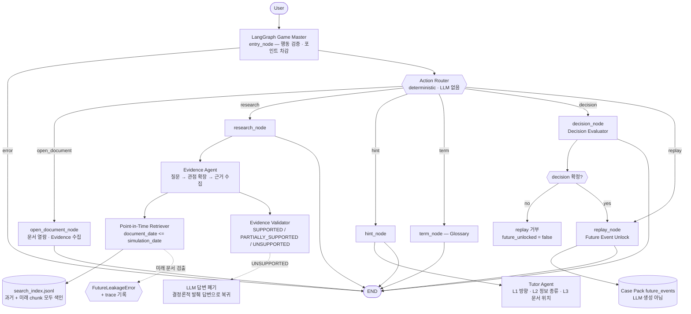

# 탐정 Agent Backend — LangGraph + Point-in-Time RAG

Case Pack(`data/artifacts/case_packs/CASE-*.json`)을 실제 플레이 가능한 백엔드로 만든 것.
Multi-Agent를 많이 만드는 게 목적이 아니다. **LangGraph가 조사 상태를 관리하고, 실제 공시
검색이 필요할 때만 적절한 도구와 Agent를 호출하는 구조**가 목적이다.

MVP에서 확실히 동작해야 하는 세 가지:

| # | 항목 | 어디서 보장하나 |
|---|---|---|
| 1 | Point-in-Time Retrieval | `src/dart_detective/retriever.py` — 후보 풀 절단 + 사후 assertion |
| 2 | Evidence 기반 AI Hint | `src/dart_detective/agents/tutor_agent.py` — 3단계, 숫자 금지 |
| 3 | LangGraph State 관리 | `src/dart_detective/state.py` + `graph.py` — checkpointer(thread=세션) |

---

## 1. 전체 Graph



State 전이는 checkpointer가 보관한다(세션 1개 = LangGraph thread 1개).

---

## 2. Game State

`src/dart_detective/state.py`

```python
{
    "case_id": str,
    "simulation_date": str,
    "opened_documents": list[str],     # D01 …
    "found_evidence": list[str],       # E01 …
    "learned_terms": list[str],
    "investigation_points": int,       # 시작 100
    "conversation": list[dict],
    "decision": str | None,
    "decision_record": dict | None,
    "future_unlocked": bool,
    "future_events": list[dict],       # unlock 전에는 비어 있고, public_state에서도 감춰진다
    "hint_level": int,
    "action": str, "action_input": dict, "last_response": dict, "error": str | None,
    "trace": list[dict],
}
```

- **checkpoint**: `InMemorySaver`. `GameSession.config = {"configurable": {"thread_id": session_id}}`.
  프로세스 재시작까지 살려야 하면 `build_graph(checkpointer=SqliteSaver(...))`로 교체하면 된다.
- **직렬화 불가능한 부품**(retriever, LLM client, TraceRecorder)은 State에 넣지 않는다.
  `nodes.SessionRuntime`에 담고 `thread_id`로 조회한다.
- `public_state()`는 프론트로 나가는 뷰다. `future_unlocked`가 False면 `future_events`
  키 자체가 없다.

---

## 3. Deterministic Action Router

버튼으로 명확히 구분되는 행동에는 LLM routing을 쓰지 않는다.

```python
def route_action(state) -> str:
    if state.get("error"):
        return "end"
    return state.get("action", "end")   # research / hint / term / decision / replay / open_document
```

`entry_node`가 먼저 행동 유효성과 조사 포인트를 검사한다. 여기서 걸리면 어떤 Agent도
실행되지 않는다.

| action | 비용 | LLM 호출 |
|---|---:|---|
| `open_document` | 5 | 없음 |
| `research` | 10 | 있음(있을 때만) — 질문 해석 + 답변 생성 |
| `hint` | 15 | 있음(L1·L2만) — 문장 생성 |
| `term` | 0 | 없음 |
| `decision` | 0 | 없음 |
| `replay` | 0 | 없음 |

---

## 4. Point-in-Time Retriever

가장 중요한 부품. 세 겹으로 막는다.

1. **후보 풀 절단** — 점수화 *이전*에 `document_date <= simulation_date`로 인덱스를 자른다.
   ```python
   def candidate_indices(self, enforce_date_filter=True):
       if not enforce_date_filter:
           return list(range(len(self.chunks)))
       return [i for i, c in enumerate(self.chunks) if c.document_date <= self.simulation_date]
   ```
2. **사후 assertion** — 검색이 끝난 뒤 한 번 더 검사하고, 미래 문서가 하나라도 있으면
   `FutureLeakageError`를 던지며 `offending` 목록을 예외에 담는다. `research_node`가 이를
   잡아 trace에 남긴다.
3. **인덱스에 미래 문서를 일부러 포함** — 필터가 실제로 일하는지 증명하기 위해서다.
   필터를 끄면 미래 공시가 상위에 잡힌다(아래 실행 결과 참고). "미래 문서가 애초에 없어서
   통과하는" 가짜 안전을 배제한다.

검색 결과 형식:

```json
{"document_id": "D02", "document_date": "2023-05-15",
 "title": "분기보고서 (2023.03) — …", "text": "…", "score": 32.7856}
```

검색 엔진은 의존성 없는 BM25(`retriever.BM25`)다. 한국어는 형태소 분석기 대신 음절 bigram을
쓴다(조사 변화에 견디는 값싼 방법).

> `enforce_date_filter=False`는 **테스트/시연 전용**이다. 운영 경로(`Evidence Agent`)는
> 항상 기본값(True)으로만 호출한다.

---

## 5. Evidence Agent

`src/dart_detective/agents/evidence_agent.py`

1. 자유 질문 → 조사 관점 확장. "이 회사가 이 투자를 감당할 수 있어?" →
   `현금및현금성자산 / 자기자본 / 자본총계 / 부채총계 / 영업이익 / 매출액`
   (LLM이 없어도 동작하는 결정론적 사전 `ASPECT_KEYWORDS`)
2. 관점별로 Retriever 호출 → 중복 제거 후 상위 발췌
3. 답변 생성
   - LLM 있음: system prompt에 "발췌에 없는 숫자 금지 / 인용은 글자 그대로 / 결론 금지"
     + `output_config.format`(JSON Schema)로 구조 강제
   - LLM 없음: 질문 토큰과 겹치는 **원문 줄만 인용**해 조립 → 항상 grounded
4. Validator 통과 → 실패(UNSUPPORTED)면 LLM 답변을 버리고 3의 발췌 답변으로 되돌린다
   (`degraded_from`에 폐기된 답변과 검증 결과를 남긴다)

출력:

```json
{"answer": "", "evidence": [{"document_id": "", "quote_or_fact": ""}], "uncertainty": ""}
```

근거가 부족하면 그렇게 답한다("조사 시점까지 공개된 공시에서 이 질문에 답할 근거를 찾지 못했다").

---

## 6. Tutor Agent

정답을 알려주지 않는다. 아직 수집되지 않은 critical evidence를 목표로 삼아 3단계로 유도한다.

| Level | 무엇을 주나 | 예 |
|---|---|---|
| 1 | 방향만 | "숫자 하나만 보면 크고 작음을 알 수 없어요. 회사 전체 체력과 비교할 수 있는 재무 항목을 찾아보면 어떨까요?" |
| 2 | 찾아야 할 정보의 종류 | "재무제표 요약에서 회사가 가진 돈과 갚아야 할 돈, 한 분기에 버는 이익을 찾아 투자금액과 나란히 놓아보세요." |
| 3 | 관련 문서 위치 | "'분기보고서 (2023.03) — III. 재무에 관한 사항 / 1. 요약재무정보' 문서를 열어보세요." |

안전장치: **L1·L2 힌트에는 숫자를 넣지 않는다.** LLM이 숫자를 섞으면 `_sanitize`가
템플릿 힌트로 되돌리고 `llm.sanitized=true`를 trace에 남긴다. L3는 문서 제목을 정확히
지목해야 하므로 템플릿을 그대로 쓴다(제목의 연도 표기는 답이 아니다).

---

## 7. Evidence Validation

`src/dart_detective/agents/validator.py` — Agent가 만든 주장을 원문과 대조한다.

| 검사 | 내용 | 위반 시 |
|---|---|---|
| `quote_grounded` | `quote_or_fact`가 해당 문서 원문의 부분 문자열인가 | 다른 문서면 PARTIAL, 어디에도 없으면 UNSUPPORTED |
| `numbers_grounded` | 답변의 모든 숫자가 원문에 있는가(원→만/백만/억/조 환산만 허용) | UNSUPPORTED |
| `period_grounded` | 답변의 연도가 원문에 있는가 | PARTIAL(수치 날조가 아니라 기간 오귀속) |
| `no_unsupported_inference` | 원문에 없는 판단어(부족/충분/위험/안전 …)를 썼는가 | PARTIAL |

예시 — 프롬프트에 나온 그대로:

```
공시:  현금및현금성자산 | 239,036,839,774
생성:  "회사는 현금이 부족하다."
→ PARTIALLY_SUPPORTED (no_unsupported_inference: ["부족"])
```

---

## 8. Decision / Reality Replay

- **정답을 저장하지 않는다.** `decision_record`에는 `decision / option_id /
  used_evidence_ids / investigation_summary / feedback`만 들어간다. `correct` 같은 필드는
  없고, 테스트가 그것을 강제한다.
- 피드백 관점 5개: 재무여력 · 시장성 · 위험 · 투자규모 · 판단 수정 가능성
  (Case Pack evidence category 매핑) + critical 단서 커버리지.
- **Replay는 decision 확정 전에는 호출할 수 없다.** `replay_node`가 거부하고
  `future_unlocked`는 False로 유지된다.
- 미래 Event는 **LLM이 생성하지 않는다.** Case Pack의 `future_events`를 그대로 내보낸다
  (테스트: `events == pack.future_events`).

---

## 9. Trace

`src/dart_detective/trace.py`. 한 턴마다 다음을 남긴다.

`현재 State(before/after) · 사용자 Action · 호출 Node · Retriever Query · 검색 문서 ·
날짜 필터 · Agent 출력 · Evidence Validation 결과 · Latency · LLM 사용 여부/모델/토큰`

조회: `GET /sessions/{id}/trace`, 또는 E2E 실행 시
`work/agent-runs/CASE-001-e2e-trace.json`.

---

## 10. API

```bash
PYTHONIOENCODING=utf-8 uvicorn dart_detective.api:app --port 8000
```

| Method | Path | 설명 |
|---|---|---|
| GET | `/health` | 상태 + LLM 활성 여부 + 행동별 비용 |
| GET | `/cases` | Case 목록 |
| GET | `/cases/{case_id}` | 브리핑(문서 목록·선택지 — **future_events 없음**) |
| POST | `/sessions` | 세션 시작 → `session_id` |
| GET | `/sessions/{id}/state` | 현재 상태 |
| POST | `/sessions/{id}/actions` | 행동 실행(`research`/`hint`/`term`/`decision`/`replay`/`open_document`) |
| GET | `/sessions/{id}/documents/{document_id}` | 열람한 문서 원문(열지 않았으면 403) |
| GET | `/sessions/{id}/trace` | 전체 trace |
| DELETE | `/sessions/{id}` | 세션 종료 |

---

## 11. 실행 방법

```bash
# 0) 전제 — Case Pack이 있어야 한다
PYTHONIOENCODING=utf-8 python scripts/build_case_packs.py

# 1) 검색 인덱스 생성 (과거 + 미래 chunk 모두 색인)
PYTHONIOENCODING=utf-8 python scripts/build_case_search_index.py

# 2) Case 1건 E2E 실행 (LLM 없이 결정론적 경로)
PYTHONIOENCODING=utf-8 python scripts/run_case_e2e.py
PYTHONIOENCODING=utf-8 python scripts/run_case_e2e.py --case CASE-002 --llm   # 자격증명 있을 때

# 3) 테스트
python -m pytest tests/test_point_in_time_retriever.py tests/test_evidence_validator.py \
                 tests/test_agent_graph.py tests/test_api.py -q

# 4) API 서버
PYTHONIOENCODING=utf-8 uvicorn dart_detective.api:app --port 8000
```

설치: `pip install -e ".[agent]"` (langgraph / fastapi / uvicorn / pydantic / anthropic)

LLM 강제 비활성화: `DART_DETECTIVE_LLM=off`

---

## 12. Case 1개 기준 E2E 실행 결과 (CASE-001, LLM off)

```
CASE-001 — 4,732억원 증설 결정 — 2차전지 양극재 CAM9
기업: 에코프로비엠 (247540)   simulation_date: 2023-05-23

── Point-in-Time Retrieval 차단 확인 ─────────────────────────────
인덱스: 전체 93 chunk (과거 44 / 미래 49)

필터 OFF (테스트 전용) — '정정 신규시설투자 계약':
  2024-10-22 [FUTURE] [기재정정]신규시설투자등        score=25.8378  <-- 미래 문서
  2023-05-23 신규시설투자등 (2023-05-23 이사회 결의)   score=12.7781
  2024-10-22 [FUTURE] [기재정정]신규시설투자등        score=12.7781  <-- 미래 문서

필터 ON (운영 경로) — 같은 쿼리:
  2023-05-23 신규시설투자등 (2023-05-23 이사회 결의)   score=12.7781
  2023-05-15 분기보고서 (2023.03) — II. 사업의 내용    score=6.2456
  2023-05-23 신규시설투자등 (2023-05-23 이사회 결의)   score=6.1588

assert_no_future(필터 OFF 결과) -> FutureLeakageError: 2건 차단

── 2) Evidence Agent 조사 ────────────────────────────────────────
질문: 이 회사가 이 투자를 감당할 수 있어?

조사 시점까지 공개된 공시에서 확인되는 문장은 다음과 같다.
- 현금및현금성자산 | 210,798,647,244 | 277,818,663,484 | 23,710,225,088
- 현금및현금성자산 | 239,036,839,774 | 320,363,496,754 | 104,647,514,160
- [유동자산] | 1,766,023,915,002 | 1,429,749,278,193 | 622,506,068,014
- [유동자산] | 2,915,180,233,912 | 2,274,293,401,185 | 739,143,497,291
- [영업이익] | 71,425,671,485 | 262,632,141,341 | 127,265,730,280

Evidence Validation: SUPPORTED
  quote_grounded PASS ×5 / numbers_grounded PASS / period_grounded PASS /
  no_unsupported_inference PASS
검색된 문서 6건 (전부 <= 2023-05-23)
새로 수집된 단서: ['E05', 'E07', 'E08']

── 3) Tutor Agent ───────────────────────────────────────────────
Level 1: 숫자 하나만 보면 크고 작음을 알 수 없어요. 회사 전체 체력과 비교할 수 있는
         재무 항목을 찾아보면 어떨까요?
Level 2: 재무제표 요약에서 회사가 가진 돈과 갚아야 할 돈, 그리고 한 분기에 버는 이익을
         찾아 투자금액과 나란히 놓아보세요.
Level 3: '분기보고서 (2023.03) — III. 재무에 관한 사항 / 1. 요약재무정보' 문서를 열어보세요.
남은 critical 단서: ['E06', 'E09', 'E10']

── 5) Reality Replay 잠금 확인 (판단 전) ─────────────────────────
error: 판단을 확정하기 전에는 Reality Replay를 볼 수 없다
future_unlocked: False

── 6) Decision ──────────────────────────────────────────────────
선택: 규모 축소 (O2)
조사 요약: 재무여력 4/7 · 시장성 0/2 · 위험 0/3 · 투자규모 1/2 · 판단수정 1/1
critical 단서: 5/8 (미확인 ['E06','E09','E10'])
피드백:
  - 이 선택을 뒷받침하는 근거 1건을 실제로 확인했다: E05.
  - 반대 방향 근거 E12는 확인하지 않았다. 반대 근거를 보지 않은 판단은 근거가 한쪽뿐이다.
  - 축소를 택했다면 근거가 된 재무 압박(E05·E06)과 수요 신호(E09·E10)를 확인했는지 돌아보라.

── 7) Reality Replay (판단 후) ──────────────────────────────────
[2023-06-30] 전환사채(CB) 4,400억원 발행 결정 (표면 0.0% / 만기 2.0%)
[2023-12-01] 삼성SDI와 NCA 양극소재 중장기 공급계약 43,867,615,524,480원
[2024-10-22] 신규시설투자 정정 — 종료일 2024-12-31 → 2026-12-31 (증설속도 조정)
[2024-10-28] 신종자본증권 2,440억원 발행 (표면이자율 6.281%)

── Trace ────────────────────────────────────────────────────────
11턴 -> work/agent-runs/CASE-001-e2e-trace.json
  open_document  0ms  · research 3ms retrieved=6 validation=SUPPORTED
  hint ×3 · term ×2 · replay(ERROR=replay_locked) · decision · replay
```

---

## 13. 의도적으로 하지 않은 것

- 필요 없는 Agent 추가 / 자유형 NPC / A2A 삽입 — 없음
- 모든 버튼마다 LLM 호출 — 없음(`term`/`decision`/`replay`/`open_document`는 LLM 0회)
- 실시간 Case 자동 생성 — 없음(Case Pack은 정적 산출물)
- 복잡한 메모리 시스템 — 없음(LangGraph checkpointer가 전부)
- 지나친 abstraction — Agent 2개 + Validator 1개 + Retriever 1개

## 14. 남은 일

- checkpointer를 `InMemorySaver` → 영속 저장소로 교체(프로세스 재시작 시 세션 유실)
- `experiments/retrieval_benchmark/`의 Dense/Hybrid 검색과 연결(현재는 BM25 단독)
- LLM 경로의 회귀 테스트 — 현재 테스트는 결정론적 경로만 검증한다
